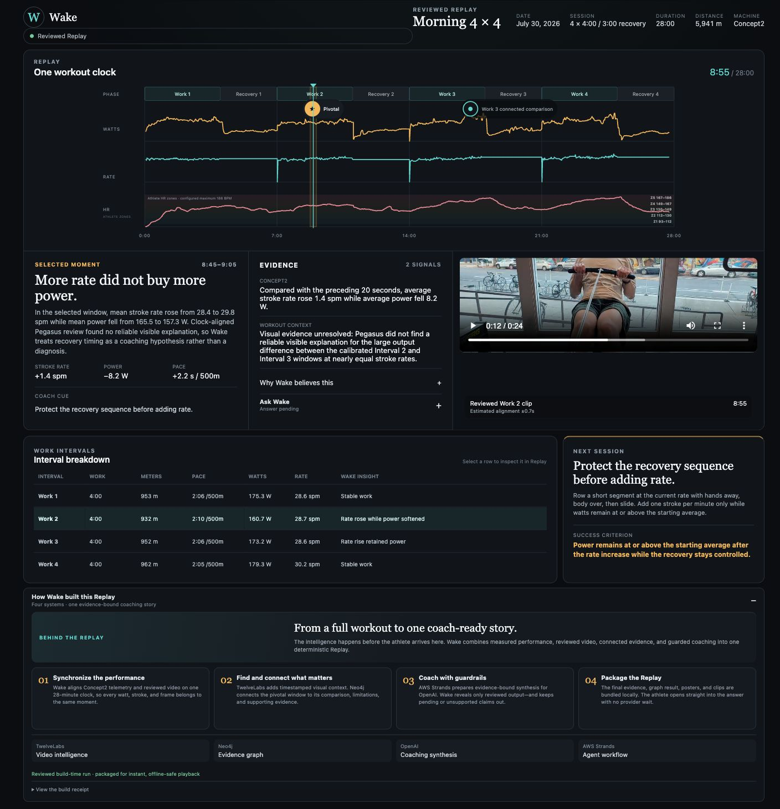
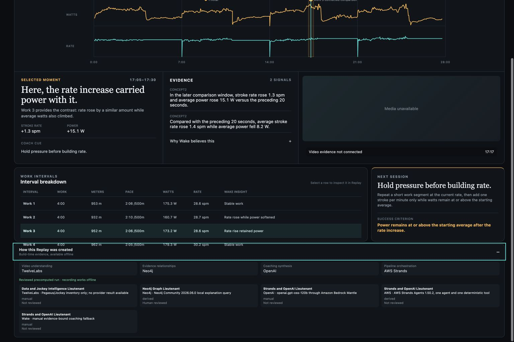
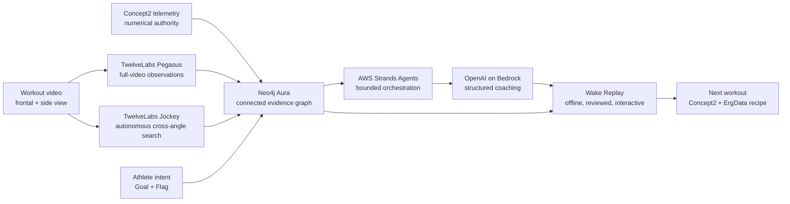

# Wake

### Multimodal coaching that remembers the whole workout.

Wake turns Concept2 telemetry, workout video, athlete-authored notes, and
agent-generated evidence into one synchronized coaching Replay.

It does not hand the athlete another dashboard or a pile of AI observations.
Wake reconstructs the session on one clock, finds the moments worth reviewing,
shows the evidence behind each claim, and converts the workout into a specific
next session.

[Watch the narrated Replay](artifacts/recording/wake-replay-narrated.mp4) ·
[See the final demo script](docs/current/final-judge-demo-script.md)



## From workout data to coaching memory

Concept2 knows exactly what happened to pace, power, stroke rate, distance, and
heart rate. Video preserves movement and context. The athlete may also remember
something that neither source understands: a goal spoken during an interval or a
gesture marking a moment for later review.

Wake brings those signals together:

```text
measurements + video + athlete intent
                  ↓
        one synchronized Replay
                  ↓
     reviewed insights and evidence
                  ↓
       an executable next workout
```

The result feels less like analyzing a file and more like reviewing the session
with an attentive coach.

## The Replay

Wake opens directly on a completed, navigable workout:

- **One workout clock** aligns four work intervals, recoveries, Concept2
  telemetry, heart-rate zones, video, evidence, and athlete-authored marks.
- **Five reviewed insights** can be selected independently and traced back to
  the interval, samples, clips, comparisons, and limitations that earned them.
- **Goal and Flag events** let the athlete speak a target or bookmark a moment
  during training, then return to it during review.
- **Evidence on demand** keeps the coaching concise while preserving provider,
  timestamp, confidence, counterevidence, and uncertainty.
- **Local reviewed media** seeks directly to the relevant frontal, comparison,
  Goal, Flag, or supplemental side-view clip.
- **A next-workout prescription** turns the review into an exact Concept2
  variable-interval session with pace targets, rate targets, recoveries, success
  criteria, and a copyable ErgData recipe.

## What Wake found

The golden Replay is a real 28-minute, 5,941-meter Concept2 session—not a
synthetic dashboard.

| Reviewed finding | Evidence |
|---|---|
| **Work 2 built power every minute** | Minute averages rose `150.4 → 159.6 → 160.9 → 171.7 W`. |
| **Work 3 finished with a large surge** | Minute 4 exceeded minute 1 by `71.9 W` and `4.0 spm`. |
| **Work 4 was the strongest interval** | It ranked first in average watts, pace, distance, and stroke rate. |
| **The athlete achieved a spoken sub-2:15 Goal** | All `95/95` recorded samples after the Goal were under target, averaging `2:03.9/500m`. |
| **Nearly equal rates produced radically different output** | `157.3 W at 29.8 spm` versus `215.3 W at 30.4 spm`—a `58 W` difference the frontal camera could not reliably explain. |

That final limitation matters. Wake reports the visual explanation as
**unresolved** instead of pretending that a camera can measure force or prove a
biomechanical cause.

## Sponsor-powered, evidence-bound

Wake uses each sponsor technology for the part of the coaching problem it is
best suited to solve.

### TwelveLabs — video intelligence across time and angle

**Pegasus** analyzes the complete workout and returns structured, timestamped
observations. Wake calibrates those observations to the Concept2 workout clock,
checks them against the telemetry, and rejects claims the video cannot support.

**Jockey** performs autonomous investigation across the video knowledge store.
In the hero comparison, it searched beyond the frontal recording and selected a
side-view source without being handed the clip. The side view surfaced a
candidate sequencing mechanism for further review.

Wake preserves the boundary: that Jockey result is clip-local,
hypothesis-only, and not proof that the mechanism caused—or even occurred
during—the selected workout windows.

### Neo4j Aura — the connected explanation layer

Aura stores more than final answer text. It connects:

```text
Workout
  → Segment
  → Event
  → Observation
  → Provider
  → Insight
  → WorkoutPrescription
```

The live graph contains the reviewed workout, calibrated provider evidence,
counterevidence, five deterministic insights, the supplemental cross-angle
context, and the next-session prescription.

Every athlete-facing claim can be followed back to the exact performance
window, source, comparison, and limitation behind it. The final Aura build is
idempotent, constraint-backed, and captured into an equal offline cache so the
Replay remains reliable without flattening the graph's provenance.



### AWS Strands Agents — orchestration with guardrails

Strands carries a bounded evidence bundle through the coaching workflow:

1. retrieve only the relevant Neo4j context;
2. supply the reviewed evidence to the model route;
3. require structured coaching output;
4. validate citations and every repeated numeric value;
5. package only accepted output for the Replay.

The agent lane is deliberately outside the browser. Provider latency or
authorization cannot break the athlete experience, and an incomplete response
cannot quietly become coaching.

### OpenAI on Amazon Bedrock — evidence into coaching language

The model lane is designed to turn connected evidence into concise,
athlete-facing coaching—not to invent measurements or override Concept2.

OpenAI model access is routed through Amazon Bedrock and bounded by Wake's schema,
citation, and numeric checks. The repository preserves provider state honestly:
when a real response has not passed the review gate, Wake uses labeled,
deterministic coaching rather than presenting a synthetic response as verified.

## The multimodal evidence loop



Concept2 identifies a candidate. Pegasus answers a targeted video question.
Wake reconciles the response with telemetry. Jockey can widen the investigation
across angles. Neo4j preserves the supporting evidence, counterevidence, and
limitations. Strands and the model lane translate only accepted context into
coaching. The reviewed result enters the Replay.

Unsupported claims stop at the evidence boundary.

## Technical highlights

- **Calibrated multimodal time:** video and Concept2 are aligned with
  `workoutSeconds = videoSeconds + 31.089`, with estimated uncertainty of
  `±0.7s`.
- **Deterministic insight derivation:** interval progression, ranking, Goal
  evaluation, and cross-window comparisons are recomputed from normalized
  Concept2 samples.
- **Graph-native provenance:** supporting evidence, contradicting evidence,
  provider observations, limitations, derived insights, and recommendations
  remain connected instead of being embedded in prose.
- **Honest uncertainty:** “not detected,” “not established,” “hypothesis-only,”
  and “visual evidence unresolved” are product states, not hidden failure modes.
- **Athlete-authored context:** spoken Goals and gesture Flags are visually
  distinct events with reviewed local clips and explicit attribution.
- **Executable coaching:** the next session is a complete `4 × 4:00 / 3:00`
  RowErg workout, not a vague drill.
- **Offline-first delivery:** the production Replay packages its graph results,
  evidence, posters, and H.264 clips locally for reliable playback.
- **Reproducible verification:** graph seeding is idempotent; live Aura results
  are checked against cached output; normalized evidence, media hashes, codecs,
  timestamps, citations, and numeric claims are validated before packaging.

## Why Wake is different

Most sports products choose one of two extremes:

- data-rich dashboards that leave interpretation to the athlete; or
- AI summaries that hide how the conclusion was reached.

Wake keeps the coach-like answer simple while making the full reasoning surface
inspectable.

**Insight first. Evidence on demand. Action at the end.**

The Replay is the product.
