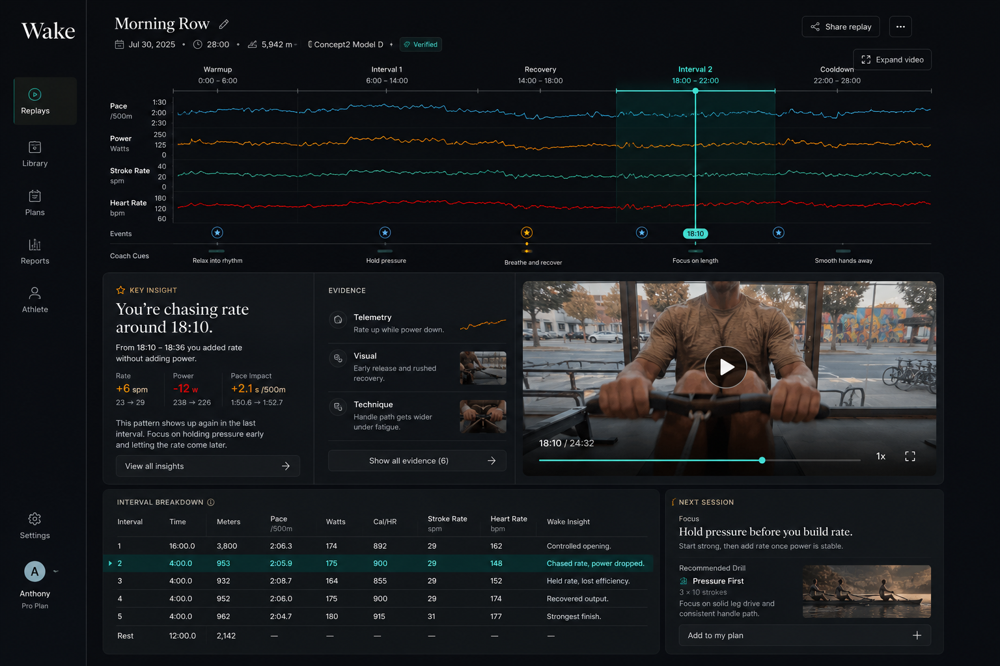

# Wake End-State Screenshot Reference

Status: Visual acceptance target

Use this page to judge whether the finished application looks like the intended
artifact before recording.

The image is a composition reference, not a data fixture.

## Preserve

- Compact navigation rail rather than a full dashboard sidebar.
- Session identity in the upper-left of the content area.
- Full-width Replay as the dominant visual region.
- Phase bands, aligned telemetry, event markers, cues, and one shared playhead.
- One horizontal selected-moment workspace:
  insight → evidence → compact video.
- Interval comparison and Next Session card completing the lower row.
- Dark graphite surfaces, quiet separators, teal selection, and amber coaching.
- Dense but readable information at a desktop recording viewport.
- A complete first frame that does not require navigating from a home screen.

## Correct

Do not copy these stale or unverified details from the mockup:

- Change the date from July 30, 2025 to July 30, 2026.
- Use the normalized 28:00 `4 × (4:00 / 3:00 recovery)` structure.
- Use source-derived session distance and interval values.
- Do not use 18:10 as a work-interval hero event; it is in Recovery 3.
- Replace all metric deltas with values reproduced from the final hero window.
- Replace generic “Verified” with “Reviewed Replay” unless full verification is
  genuinely implemented.
- Show only provider evidence backed by real or cached-real artifacts.

## Target First Frame

At the recording viewport, the judge should see without scrolling:

1. Wake and the session title.
2. The entire 28-minute workout shape.
3. Work and recovery structure.
4. Watts and stroke-rate tracks.
5. A selected pivotal marker.
6. One decisive coaching headline.
7. Two compact evidence summaries.
8. A mapped video frame or truthful poster.
9. Work-interval comparison.
10. One next-session drill.

The collapsed sponsor-provenance affordance should also be visible, but it must not
compete with the coaching insight.

## Screenshot Hints

- Capture at 1536 × 1024 when possible; 1440 × 900 is the minimum recording target.
- Keep browser zoom at 100%.
- Use a production build, not a development error overlay.
- Preselect the final hero event for the primary still.
- Seek the mapped media to a legible frame rather than motion blur.
- Place the pointer away from key text before capturing.
- Ensure the Replay, insight headline, evidence labels, and drill remain readable at
  the exported image size.
- Avoid scrollbars, clipped cards, empty loading regions, and placeholder copy.
- Capture one clean opening-state screenshot and one expanded-evidence screenshot
  as recording fallbacks.

## Visual Acceptance Test

The screenshot passes when:

- Replay is the first thing the eye reads;
- the coaching headline is the second;
- evidence and video explain the selected moment;
- the bottom row completes the story without introducing a second dashboard;
- no stale date, timestamp, metric, or provider claim remains;
- the page looks like a finished product rather than a prototype shell.
